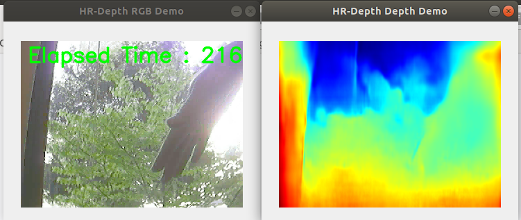

# depth_estimation
executable demonstration of TensorFlow implementation for depth estimation
 using the model proposed in:
> HR-Depth: High Resolution Self-Supervised Monocular Depth Estimation
> Xiaoyang Lyu, Liang Liu, Mengmeng Wang, Xin Kong, Lina Liu, Yong Liu*, Xinxin Chen and Yi Yuan

[official implementation repository](https://github.com/shawLyu/HR-Depth)
## Installation
can be installed from PyPI using `pip` or your package manager of choice:

```bash
pip install git+https://github.com/AbdullahMu/depth_estimation
```
## Usage



## 3.A.  HR-Depth with ONNX Runtime in Python
To prepare the downloaded ONNX models, execute the following command:
```bash
python onnx_merge.py
```
the following output should be printed to console upon successful execution
```bash
graph1 outputs: ['317a', '852a', '870a', '897a', '836a']
graph2 inputs: ['0b', 'input.1b', 'input.13b', 'input.25b', 'input.37b']
Constructing the io_match list from your input and output
```

### CLI
This Tensorflow implemention is executable as a CLI tool using the `depth_estimation` command. The trained model is downloaded and saved automatically, then is run using the privided video sample.

> Written with [StackEdit](https://stackedit.io/).
